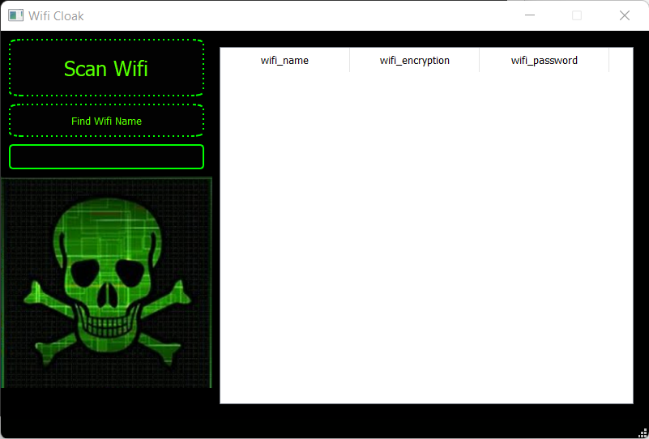
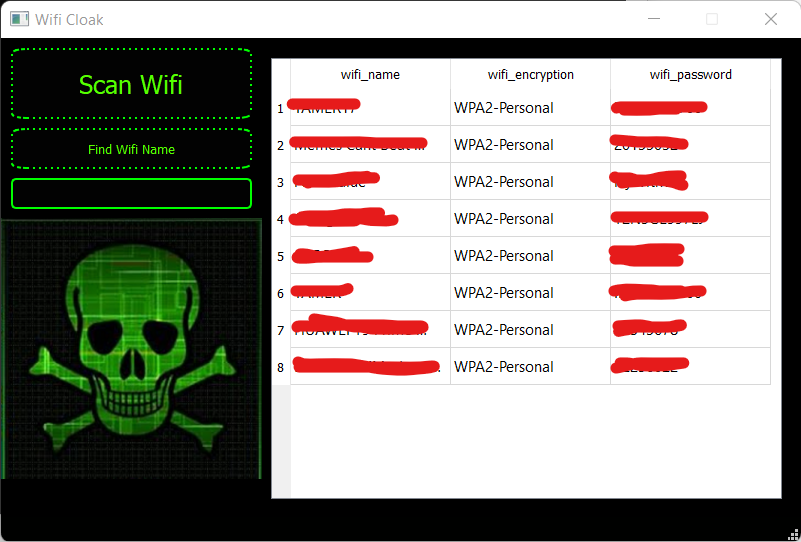
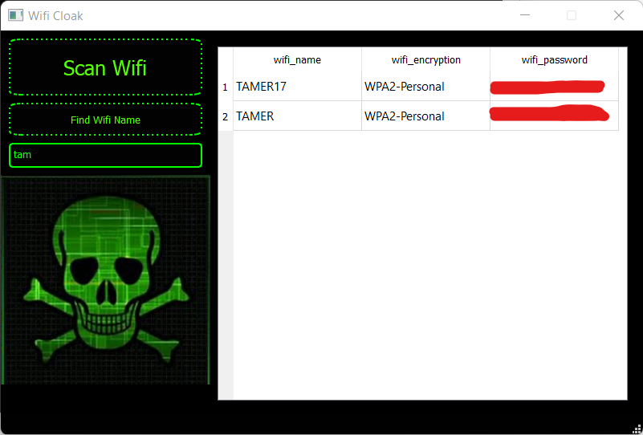

# Python-Wifi-Cloak
Wifi Cloak created using Python

<h2>
  Warning :
</h2>

* This Tool is for Educational and Safe purposes only, do not use it to harm others !
</h1>

<h2>
  Usage :
</h2>

- General Use => Wifi Cloak is a program that recalls all Wifi Passwords that had been used on your computer 
- Scan Wifi => Retrieves all wifi SSIDS with Passwords that your pc has logged into them
- Find Wifi Name => Retrieves Only Wifi Profiles that matches your input

</h1>

<h2>
  Preview :
</h2>

